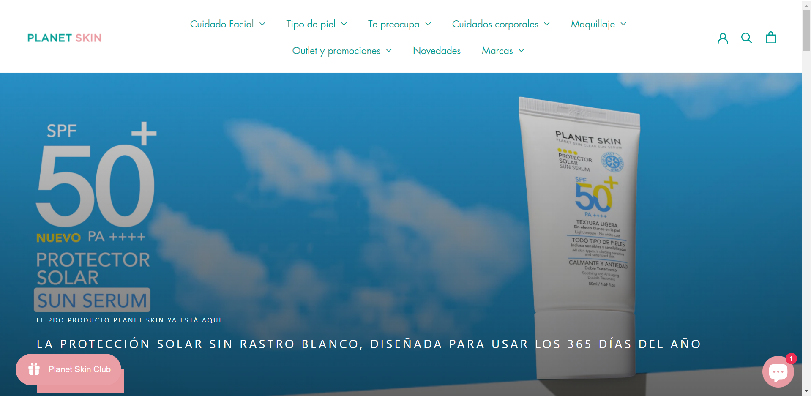

# Ejercicio de HTML y CSS: Réplica Landing Page

En este ejercicio, aprenderás a crear una página web replicando el diseño de una imagen de referencia. Deberás utilizar HTML, CSS y aplicar media queries para adaptar el diseño a diferentes tamaños de pantalla.

## Instrucciones

1. Haz fork y clona este repositorio en tu entorno de desarrollo:

   ```
   git clone (url del repo del ejercicio)
   ```

2. Utiliza los comandos necesarios en la consola de git para abrir el repositorio.

3. Crea el archivo `index.html` en VSCode. Este será el punto de inicio para tu proyecto.

4. Crea el código necesario para replicar el diseño de la imagen de referencia proporcionada en la carpeta `img`. Asegúrate de que el diseño sea fiel a la imagen, incluyendo la estructura del sitio, los colores y las fuentes.

5. Implementa las siguientes media queries en tu CSS para cambiar el diseño en función del tamaño de la pantalla:

   - Cuando la pantalla sea menor de 480px, el menú del navbar debe convertirse en un menú desplegable u oculto.
   - Cuando la pantalla sea mayor de 480px y menor de 768px, el menú tendrá que estar en el lateral.

6. Asegúrate de que el diseño sea responsive.

7. Cuando hayas completado el ejercicio, haz un commit y un push de tus cambios al repositorio.

## Imagen de Referencia

A continuación, puedes ver la imagen de referencia que debes replicar en tu diseño:



## Recursos Adicionales

Puedes consultar la documentación de HTML y CSS para obtener ayuda adicional:

- [HTML MDN Web Docs](https://developer.mozilla.org/en-US/docs/Web/HTML)
- [CSS MDN Web Docs](https://developer.mozilla.org/en-US/docs/Web/CSS)
